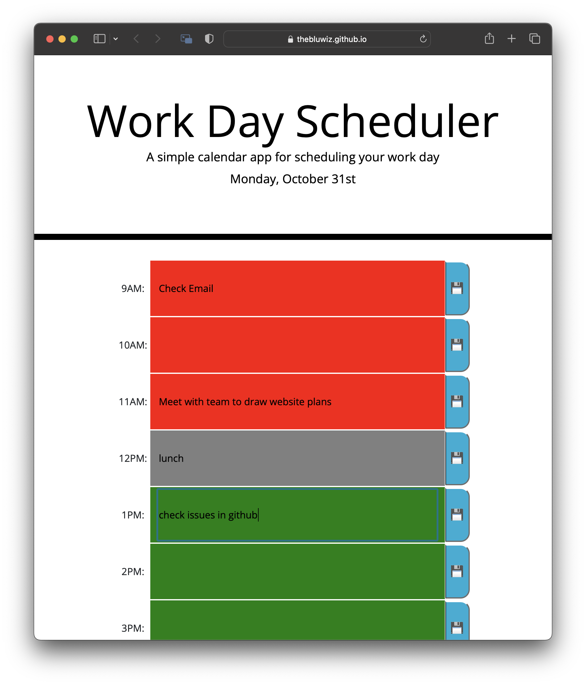

# Daily Planner
## Description
This daily planner keeps track of user goals for any given hour. A user must simply hit the save button next to any text entry field and the data inside will persist in local storage. The CSS dynamically adjusts using jQuery and changes the color of text fields based on time. 

## Tasks
- Created Table for each hour of the typical work day.
- Created state variables to keep track of the users work plans.
- Dynamically updates the UI based on time of day
- Allows plan persistance through page refreshes

## Moving Forward
Next up I'd like to set the application to check once each minute to confirm if the time has progressed into the next hour.  It might be cool to make a new line item for each commit within a given hour. It also would be slick to have the input field expand for each item included. 

## Example

## Deployed Site
The planner can be found [here](https://thebluwiz.github.io/workday-planner/).